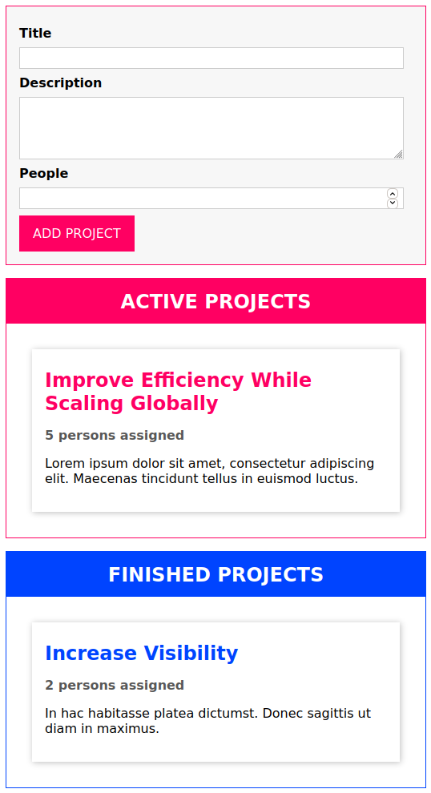

# Project Manager - Drag & Drop

## 💻 Projeto

Projeto desenvolvido com base nas aulas do curso [Understanding TypeScript - 2020 Edition][course], oferecido por [Maximilian Schwarzmüller][author].

## Tecnologias

As seguintes tecnologias foram utilizadas no desenvolvimento do projeto:

- [TypeScript][typescript]
- [Webpack][webpack]

## 📷 Screenshots

<kbd>
  
</kbd>

[course]: https://www.udemy.com/course/understanding-typescript/
[author]: https://www.udemy.com/user/maximilian-schwarzmuller/
[typescript]: https://www.typescriptlang.org/
[webpack]: https://webpack.js.org/
